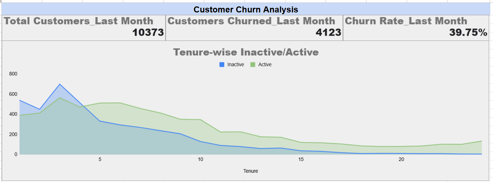
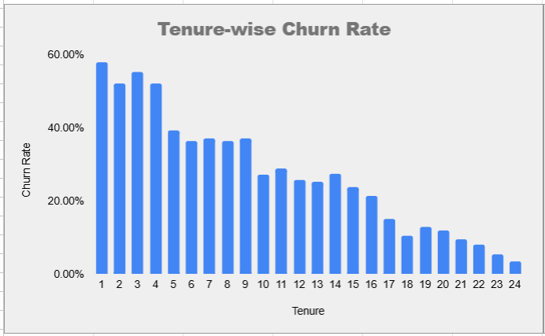
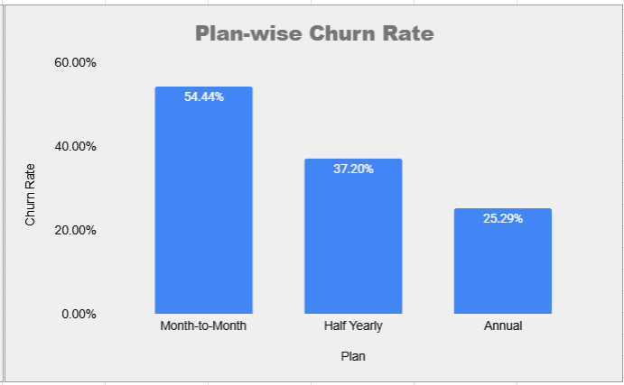
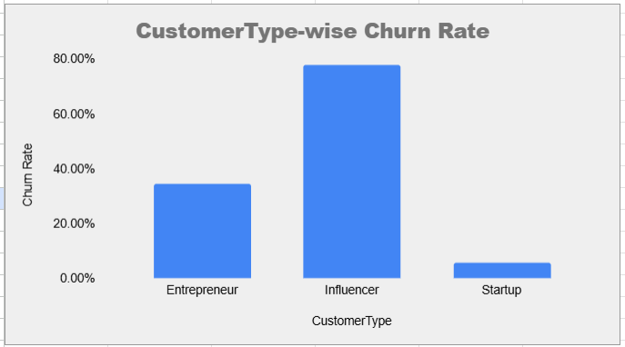
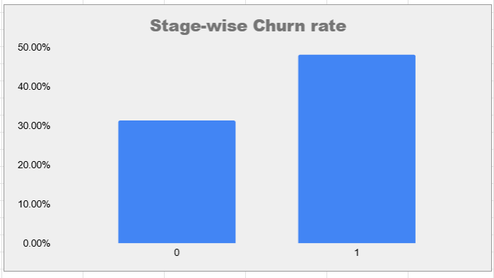

# 📉 ProLink – Customer Churn Analysis

**ProLink**, a platform for business professionals to engage with their customers, recently experienced a noticeable decline in user retention. This project aims to analyze the churn data to uncover user segments and behavior patterns contributing to customer drop-off — helping inform ProLink’s retention strategy.

---

## 🎯 Objective

Key focus areas in this churn analysis:

- 📅 **Tenure**: Relationship between time spent using the app and churn probability.
- 📦 **Plan Type**: Which subscription plan (Month-to-Month, Half-Yearly, Annual) contributes most to churn?
- 👤 **Customer Type**: Do Entrepreneurs, Influencers, or Startups churn more?
- 🧱 **Stage**: Do Established or Emerging businesses show higher churn rates?

---

## 📊 Dataset Overview

Sheet: `Data_CustomerChurn`

| Column            | Description                                      |
|-------------------|--------------------------------------------------|
| `CustomerID`      | Unique ID for each customer                      |
| `CustomerType`    | Entrepreneur, Influencer, or Startup             |
| `Stage`           | Emerging (0) or Established (1)                  |
| `Tenure`          | Months with ProLink                              |
| `Plan`            | Subscription term                                |
| `PaymentMethod`   | UPI, Debit Card, Credit Card                     |
| `MonthlyCharges`  | Last month’s charges                             |
| `TotalCharges`    | Lifetime charges                                 |
| `Churn`           | "Yes" if churned, "No" otherwise                 |

---

## 🧹 Data Cleaning Steps

- Converted `TotalCharges` and `Tenure` into numeric columns
- Replaced 0/1 in `Stage` with `Emerging` and `Established`
- Cleaned nulls and inconsistencies
- Segmented churned vs non-churned users
- Created derived fields for dashboard filters

---

## 📈 Dashboards & Visuals

### 1. Tenure-Wise Activity Analysis  
Insight: Majority of churn occurs in short-tenured customers.

---

### 2. Tenure-Wise Churn Rate  
Shorter tenures correlate with higher churn probability.

---

### 3. Plan-Wise Churn Rate  
Month-to-month users churn the most, while long-term plans show better retention.

---

### 4. Customer Type Churn Breakdown  
Entrepreneurs retain better than Startups and Influencers.

---

### 5. Business Stage Churn Rate  
Emerging businesses are more prone to churn.

---

## 💡 Key Insights

- ❗ Churn is highest among users in their first 3–5 months
- 🔁 Month-to-month customers churn faster than annual customers
- 🧑‍💼 Entrepreneurs are more loyal; startups require better onboarding
- 📉 Emerging businesses need more engagement support

---

## 🛠 Tools Used

- Microsoft Excel  
- Pivot Tables, Filters, Formulas  
- Visualizations using Bar & Line Charts  

---

## 👤 Author

**Shubham Kumar**  
📧 shubhamkr3524@gmail.com  
🔗 [LinkedIn Profile](https://www.linkedin.com/in/shubham35/)

---

## 📌 Future Improvements

- Predictive churn modeling in Python or Power BI  
- Customer segmentation scoring  
- Retention action plan using marketing automation  
