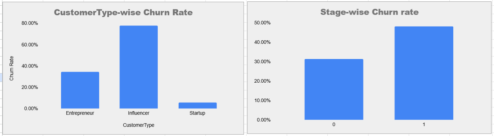

# 📉 ProLink – Customer Churn Analysis

**ProLink**, a business engagement platform for professionals, has observed a drop in user retention. This project focuses on uncovering the factors contributing to user churn and identifying key customer segments to improve retention strategies and engagement.

---

## 🎯 Objective

The analysis is designed to uncover patterns around customer churn by exploring:

- 📅 **Tenure**: How does the time a customer spends on ProLink affect their likelihood to churn?
- 📦 **Plan Type**: Which subscription plans (Month-to-Month, Half-Yearly, Annual) have the highest churn?
- 👤 **Customer Type**: Do Entrepreneurs, Influencers, or Startups show higher churn trends?
- 🧱 **Stage**: How does churn differ between Emerging and Established businesses?

By answering these questions, we aim to guide ProLink in refining its user retention strategy.

---

## 📊 Dataset Overview

Sheet Name: `Data_CustomerChurn`

| Column            | Description                                      |
|-------------------|--------------------------------------------------|
| `CustomerID`      | Unique customer identifier                       |
| `CustomerType`    | Entrepreneur, Influencer, or Startup             |
| `Stage`           | Business stage – Emerging (0) or Established (1) |
| `Tenure`          | Number of months the customer used the app       |
| `Plan`            | Month-to-Month, Half-Yearly, or Annual           |
| `PaymentMethod`   | UPI, Debit Card, or Credit Card                  |
| `MonthlyCharges`  | Last month's charges                             |
| `TotalCharges`    | Total charges paid across tenure                 |
| `Churn`           | "Yes" for churned customers, "No" otherwise      |

---

## 🧹 Data Cleaning and Preparation

- Converted numeric columns to correct types (e.g. `Tenure`, `MonthlyCharges`)
- Removed null or inconsistent entries
- Re-labeled `Stage` values from binary (0/1) to `Emerging` and `Established`
- Mapped and grouped churn values
- Created visual segmentations using pivot tables and custom filters

---

## 📊 Dashboards & Visual Insights

### 1. Tenure vs. Churn Behavior  
Customers with shorter tenures tend to churn more frequently. Loyalty increases with app usage duration.

---

### 2. Tenure-Wise Churn Rate  
A closer look at churn rates across tenure bands confirms higher drop-offs in the initial months.

---

### 3. Plan Type vs. Churn Rate  
Month-to-month users exhibit the highest churn, while Annual plan users show much higher retention.

---

### 4. Customer Type & Business Stage vs. Churn  
Startups and Influencers churn more than Entrepreneurs. Also, Emerging businesses show higher churn compared to Established ones.

---

## 🛠 Tools Used

- 📊 Microsoft Excel
- 📐 Pivot Tables & Conditional Formatting
- 📈 Line and Bar Graphs
- 💡 Logical formulas (`IF`, `COUNTIFS`, `AVERAGEIFS`, etc.)

---

## 🔍 Key Findings

- Short-tenured users (under 3 months) are most churn-prone
- Entrepreneurs and Established businesses show the lowest churn
- Annual and Half-Yearly plans provide better customer retention
- Startups and Emerging businesses need more onboarding & support focus

---

## 👤 Author

**Shubham Kumar**  
📧 shubhamkr3524@gmail.com  
🔗 [LinkedIn](https://www.linkedin.com/in/shubham35/)

---

## 📌 Next Steps

- Build churn prediction models using Python or Power BI
- Create retention scoring framework
- Recommend data-backed strategies like loyalty programs or plan bundling

